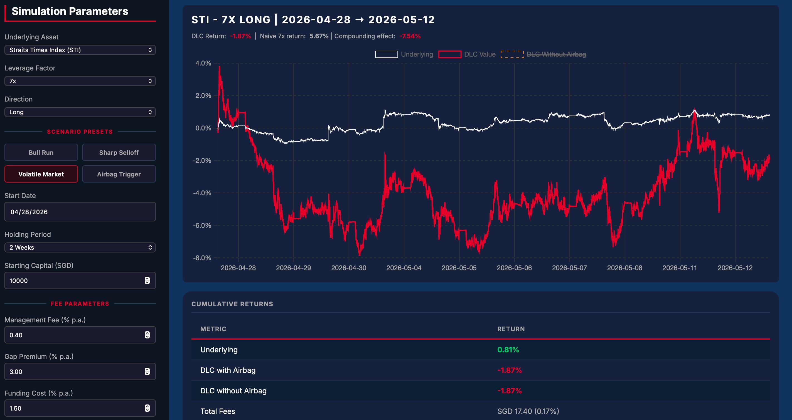
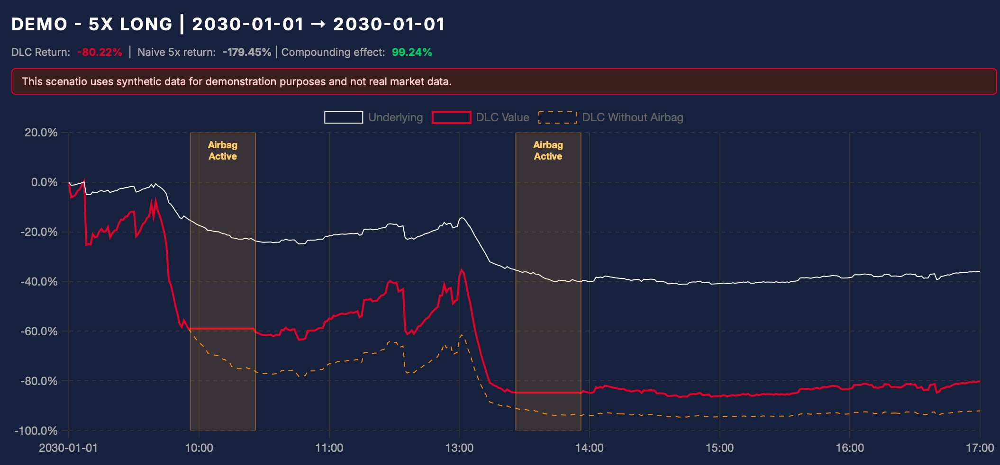

# Daily Leverage Certificate (DLC) Simulator

An interactive web-based simulator modeling the mechanics of Daily Leverage Certificates (DLCs) on the Singapore Exchange (SGX), built as a project for **FIN 7870 - Financial Derivatives** at Hong Kong Baptist University.

Beyond the course requirements of a technical report and presentation, I chose to build a full interactive simulation engine from scratch in vanilla JavaScript - modeling daily reset compounding, fee drag, and SGX's "airbag" intraday circuit-breaker mechanism using real minute-by-minute market data.

**[→ Launch the Live Simulator](https://lucashkbu.github.io/DLC-Simulator/)**

---

## Screenshots

**Volatile Market Scenario** — STI 7x Long over 2 weeks. The underlying ended +0.81% but the DLC lost −1.87% due to compounding decay in a choppy market, illustrating why DLCs are designed for short-term directional trading, not buy-and-hold.

**Airbag Mechanism Demo** — Synthetic single-day crash scenario with two airbag triggers. Shaded zones mark the 30-minute suspension windows where the protected DLC (red) is frozen while the unprotected counterfactual (orange dashed) continues tracking the underlying's decline.

---

## Features

- **Minute-by-minute simulation engine** — DLC valuation with daily reset mechanics, computed from real 1-minute OHLC market data across 5 instruments (HSI, STI, NDX, DBS, SGT)
- **Airbag mechanism** — accurately models SGX's intraday suspension rule, including the 30-minute freeze window and reference-level reset, with shaded chart annotations marking active suspension periods
- **Fee modeling** — management fee, funding cost, gap premium, and rebalancing cost, all configurable and applied with realistic daily compounding
- **Compounding decay tracker** — live comparison between actual DLC return and the "naive" leveraged return investors might mistakenly expect
- **Scenario presets** — one-click access to four educational scenarios: a bull run, a sharp selloff, a volatile whipsaw (demonstrating decay even when the underlying ends flat), and a synthetic crash with dual airbag triggers
- **Counterfactual comparison** — a "DLC Without Airbag" overlay line showing what would have happened without the protection mechanism, making its impact immediately visible

---

## How to Use

1. **Select an instrument** from the dropdown (indices or single stocks) and choose a leverage factor, direction (Long or Short), and holding period
2. **Click a Scenario Preset** to auto-fill parameters for a pre-selected educational scenario, or configure your own
3. **Click Generate** to run the simulation — the chart will render the underlying asset, the DLC value, and (if the airbag triggers) the unprotected counterfactual
4. **Adjust fee parameters** to see how different cost assumptions affect DLC returns over time
5. **Click Reset** to clear the chart and start fresh

The **Airbag Trigger** preset uses synthetic data (clearly labeled) to demonstrate the mechanism in a controlled scenario, since real airbag events are rare in the available data window.

---

## Tech Stack

Vanilla JavaScript, HTML5, CSS3, and [Chart.js](https://www.chartjs.org/) with the [annotation plugin](https://www.chartjs.org/chartjs-plugin-annotation/latest/) for the airbag suspension overlays. No frameworks, no build tools — a single static site deployed via GitHub Pages.

---

## Documentation

The full technical report covering the mathematics of daily reset compounding, the airbag mechanism, fee structures, issuer hedging, regulatory framework, and trading strategies is available here:

**[→ DLC Technical Report (PDF)](./DLC_Technical_Report.pdf)**

---

## Project Context

This simulator was built as part of a derivatives course project at HKBU (FIN 7870, Spring 2026). The course deliverable included a technical report and a video presentation; the interactive simulator was an additional component I developed independently to make the product's mechanics tangible and explorable.

---

*Built by Lucas F. — 2026*
